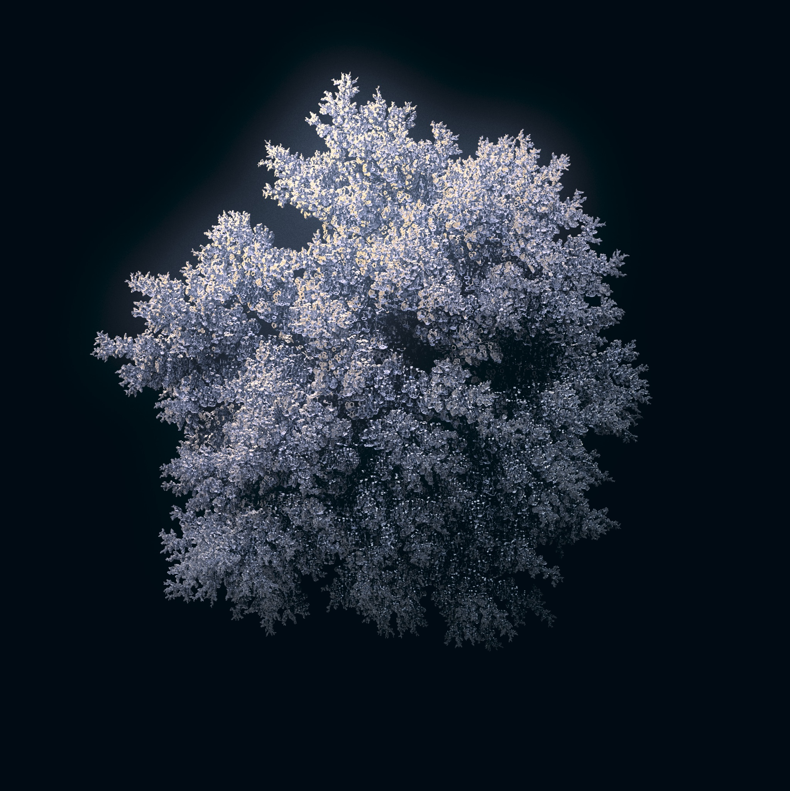

# Diffusion Limited Aggregation in Rust

Just to play with something while testing the [ɴsɪ](https://crates.io/crates/nsi) crate.


2k resolution, 66,666 instances of a scaffoldy dodecahedron. 512 shading, 64 aa-samples.
Rendered in about one minute via 3Delight Cloud.

## Prerequisites

The ɴsɪ crate indirectly depends on
[3Delight](https://www.3delight.com/) being installed.

Before you do anything you should
[download](https://www.3delight.com/download) & install this renderer
for your platform (supported: Linux, macOS & Windows).

It comes with a free, 12-core license and 1,000 (!) minutes worth of
cloud credits on registration. The latter may come in handy once you
start experimenting with the ɴsɪ crate or this codebase yourself.

## Building

As the ɴsɪ crate uses unstable Rust features you need to set the local
toolchain to `nightly`:

```console
> rustup override set nightly
```

The space partitioning insertion is extremenly slow for debug builds.
If you want to generate more than 10k particles doing a release build is
mandatory.

Because the crate has link time optimizations enabled the final build
step may be noticeably slow.

```console
> cargo build --release
```

## Running

Builds will be in the `./target` folder.

```console
> target/release/rdla --render
```

### Cloud Rendering

> “Hold on to you lug nuts it’s time for an overhaul [of your idea of
> what consitutes fast rendering]!”
>
> – analogously quoting Stanley Ipkiss, ‘The Mask’.

To render in the cloud register at
[3delight.com](https://www.3delight.com/), open the 3Delight Display app
and log in with your credentials.

Once you have done this all that is needed to launch a render in the
cloud is to add the `--cloud` flag.

```console
> target/release/rdla --render --cloud
```

## Usage

```usage
USAGE:
    rdla [OPTIONS] [SUBCOMMAND]

FLAGS:
    -h, --help       Prints help information
    -V, --version    Prints version information

OPTIONS:
    -c, --config <FILE>    Sets a custom config file
    -p, --particles <N>    Number of particles to generate (default: 1000)

SUBCOMMANDS:
    dump      Dump the result into an .nsi stream or into a Standford .ply file
    help      Prints this message or the help of the given subcommand(s)
    render    Render an image of result with 3Delight
```

## Config File

The app looks for a config file named `rdla.toml` in the current
directory.

This can be overridden with the `--config` flag.

```toml
[aggregation]
    show_progress = true
    random_seed = 42
    particles = 10000
    # Spacing can be changed over the iteration.
    # The 1st value is used for the first particle place
    # and the last for the last particle. In between,
    # spacing is linearly interpolated.
    spacing = [1.0, 1.0]
    attraction_distance = 3.0
    repulsion_distance = 1.0
    stubbornness = 0
    stickiness = 1.0

    [aggregation.start_shape]
        # Try using "ring".
        shape = "point"
        # "ring" diameter.
        diameter = 0
        # "ring no. of particles.
        particles = 1

[particle]
    # Scale can be changed over the iteration.
    # The 1st value is used for the first particle placed
    # and the last for the last particle. In between,
    # scale is linearly interpolated.
    scale = [2.0, 2.0]
    # A wavefront OBJ (converted to triangles for now)
    # to instace instead of a sphere particle.
    instance_geo = "" # "assets/cube.obj"
    subidivsion = true

[material]
    color = [0.5, 0.6, 0.8]
    roughness = 0.3
    metallic = 1.0
    specular_level = 0.8

[environment]
    texture = "assets/artist_workshop_1k.tdl"
    intensity = 1.2

[nsi_render]
    # Images are square
    resolution = 2048
    shading_samples = 100
    oversampling = 20
    bucket_order = "circle"

    [nsi_render.output]
        file_name = "out.exr"
        display = false
```
